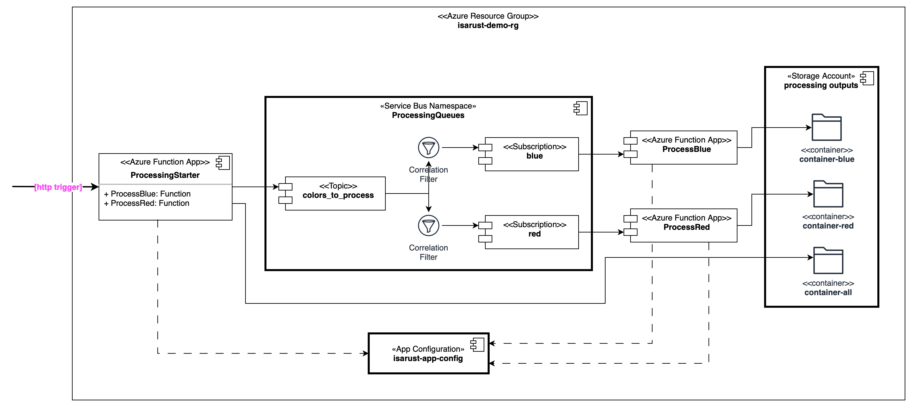

# Azure on-boarding project

Table of Content:
- [Objective](#objective)
- [ProcessingStarter](#processingstarter)
   - [HttpTrigger input binding](#httptrigger-input-binding)
   - [Multi-output binding](#multi-output-binding)
   - [App Configuration service to store binding parameters](#app-configuration-service-to-store-binding-parameters)
   - [SDK Service Bus output to a topic](#sdk-service-bus-output-to-a-topic)
   - [Using App Configuration service](#using-app-configuration-service)
   - [RBAC configuration for Blob Storage, Service Bus and App Configuration](#rbac-configuration-for-blob-storage-service-bus-and-app-configuration)
- [ProcessBlue: Service Bus trigger, Blob Storage output](#processblue-ervice-bus-trigger-blob-storage-output)
   - [ServiceBusTrigger input binding](#servicebustrigger-input-binding)
   - [Blob Storage output binding](#blob-storage-output-binding)
   - [App Configuration service to store binding parameters](#app-configuration-service-to-store-binding-parameters)
   - [RBAC configuration for Blob Storage, Service Bus and App Configuration](#rbac-configuration-for-blob-storage-service-bus-and-app-configuration)
- [DevOps: Creating infrastructure with azure cli](#devops-creating-infrastructure-with-azure-cli)
- [DevOps: Creating build/test/deploy pipeline with Yaml](#devops-creating-buildtestdeploy-pipeline-with-yaml)


Topics explored in this project:
- [Azure Functions in isolated worker process](https://learn.microsoft.com/en-us/azure/azure-functions/dotnet-isolated-process-guide)
- [Service Bus with topics and subscriptions](https://learn.microsoft.com/en-us/azure/service-bus-messaging/service-bus-tutorial-topics-subscriptions-cli)
- [Blob Storage bindings for Azure Function](https://learn.microsoft.com/en-us/azure/azure-functions/functions-bindings-storage-blob?tabs=isolated-process%2Cextensionv5%2Cextensionv3&pivots=programming-language-csharp)
- [App Configuration](https://learn.microsoft.com/en-us/azure/app-service/app-service-configuration-references)
- [Azure CLI for infrastructure as code](https://learn.microsoft.com/en-us/cli/azure/what-is-azure-cli)
- [RBAC for Azure Functions](https://learn.microsoft.com/en-us/azure/azure-functions/security-concepts?tabs=v4#user-management-permissions)

## Objective

Implement a set of three function apps following the component diagram shown below:



[SOURCE](https://viewer.diagrams.net/?tags=%7B%7D&highlight=0000ff&edit=_blank&layers=1&nav=1&title=AzureOnBoardingProject.drawio#R7Vxbc5s4FP41frQHxM1%2BtJO025nuTtp0tu2%2BdAiWbbYYsUIkTn%2F9SiAwumDjC7bTuNvpooMkJJ3vHM4N96yb5eo99pPFn2gKox4wpqueddsDABieTf%2FHKC8FxTRdUFDmOJxy2prwEP6CnGhwahZOYSp0JAhFJExEYoDiGAZEoPkYo2ex2wxF4lMTfw4VwkPgRyr1azgli2obo%2FWNP2A4X%2FBHD4FX3Fj6ZWe%2Bk3ThT9FzjWTd9awbjBAprparGxix0yvPpRj3ruFutTAMY9JmwNd%2F4k9ekiw%2F9D8HS6uPP%2F4d3vWtYpYnP8r4hnvA9ZdJz5pEdNaJ2Br%2FyjCk3T%2FDFGU4YJfvMcqSqtdcGFO28rGPmF6JlJIQpj7OUtKfwiXq43l5n27lcT0mP0LyUvKFPjaeQrY1g95%2BXoQEPiR%2BwO4%2BUyhS2oIsI9oy6eUTxCSkPB1H4TymNIKSak52D64az9SsOEUxDtESEvxCu5QDbM5cDu%2By%2BVyDCnA4cVGDiTPiRJ%2Fjc17NvWYhveBc3IGjto6j%2BXkmwgm6%2F2UMeZOlj%2BchPZSxkayqZj8%2FobGbk%2BjxkL5fHN04oCcDccFFPkONr1uR8y6LAxKimF6Ok1a4oYeQyMg5wU5EhN5jFMA0DeP5A%2FExG6bFaPOKFwr6d9lDBGf05niY03TLpX8NvsZJzvexcNaqBNYGfGZSpOsv7kOSP36Kt8XSJoiK0SzK1dssZICti98Uo%2BQL3QkkG8Q1JRj9rHSseST5HIryCVxVQIGhkU%2FT6Eo%2BHY18SmdL3xQJuwzQMkFxvtXJv5CQl%2FJ0hiWhevPYbc%2BrWWc0H6LmyNQTK2kYRj4Jn8TXp%2B4U%2BfPuUUjXVj2sD2xRo4oToNkspTCSmVAten%2B%2BuCpfbkBvPHmA%2BCnMX3WTLKX%2F%2FuUvYZpDl96etHm9rZXHpwxm1Jhp837bVXz0rzhRqKzjCJVtiUJleo6CEHukg4jblVB57YVqiaYZo3UrUe4lSZQnsMs7lUSZlsIEOKXGNW8iTBZojmI%2FultTJ6Jdt%2B7zETFA5%2FKQ84l7Cn5GkPiygauQfKtdf2dTDRzeul3xmfPGC28U62SL2ywSdC%2BF3du86WHRj5Ty2ng4DTLWmtkHyctwJ7P%2FC0rC4EAbP0ARwukPgn4khTpspQUVoZXMDqaIqV79mLdugVHrUZl3es24xWM4hpp0JNtjpKpJ09X5Bl1pydFOXH%2FIHtMAhwk3CQ9h%2FiN74O%2FOb0%2Fmt%2BWq%2FNb6gl3xu4yhnJ7hmGrwt8Zvy7HOzW9T4fcNwsUbJXe5Vc69C6Pcm5X58hOSYFG%2BhDMShTG8qSJsjDhDMblhOj0fYNH%2F3rGVTubYn4ZwfS%2BmDkxliOoGMHexRp%2Flf5jV66eLyg4oefzRf4TRPUrDfEPW7SMiBC0bQaBgpYYAtgFuRJigbPMTyHGWJsVuZ%2BGKrWNSYXU1Z7HOgf%2Bc2gPMI2EfArYeivu0uBJ7zfJTpkD%2BgQuYHwF%2BruNI6ka1Km0N%2BuzO0GefxdyL6dq%2FlUYda3yvN9b2Xt5iZ2U6ZfOe8oTunSHj2GZgKYpb7cDRgWag3uZ3gaSbTEecotgAH1UPGssTuRLKPAk%2BxQaViY7mQ6jhkqtKeysqzbKHZ1Zp7lWlKaK43bU19Fw%2BUKd5xhZV1Fanec7wvDrNOwuqXklcxLm%2BEDeCZ3QFz8nBY0rgMV4peIAmIFAkOQjCrBACGOMgoGAhrZMbSZXcoIOpWZVk5NUnOEw5bWiWGY%2B6a%2B9pLBGrswwHUH171cQ9aYoDNLzm31SOo%2BRCyxAbNaSJTx0PfHA0nc%2FT99ka20Taju3%2BSE5O3v1WcYt454vzfBKGH4jvnuhkKZ9E6w2xgjFeJXK4XgEOGNii8WkbqmqxnYFhq7Jid5UNArtVgR0fxO3zA1cUXwKKpUTHJUBYW%2FZ2Qgi3znhcEXwJCFb0sHUJIG5RGwbj6ZiVNTMGRD41vAORA6Krt4%2Fftt2d3D1AZZ0iQMU9461eotWAjhrnN6XtDnUmDVF7Ons7k5Iath1pogZnksLHf6l1y0Uw7cQ41tTUXfHcPuBqtAU0uAJaC2j9c0ZS0b7lDTeua0t%2FelGs4Liy06Kk8QSyc5mpCLulYAx%2FC7mQC8kscOKooa5asAMoeofq8TMgDFxV7y6q15YWbFnOZuhL%2Fe3h5v6yqt65P8%2F4dqraLV0ot4tPp7Z%2FkzB5C4WZI1fK9wJNYaYumt9ZoZ6lC7hdoGF8RIVagn67RrXOqVFHUqoPeNIUbTXqyJOLDKSJjqRRzaqEvHyQY25cmDoACAM60nm6%2BNxvjnjQFvENn9%2BdBvGmKUXCgLsn5E1bKrKoSlK7xrzlbvbg1AEnwfzRXTgx2w2aHbRB5YVpXLTdnLGt8G1A74GwlH0eYzTY07ZVeK9O1bEDZakOVB5zV9FA%2BVHcyesuw1%2F%2BYxU6r4Fiq2W1DKfTmjrjv43BJ%2BtVSfd9sv4FqA9g92GGk%2FYTJtG0LQks9yAcb%2FnZPLvRT%2FMsBfvs3QTKZ%2FVGUCVU1kRrNrON2Uzz%2Bb1DmUPY9%2FwEh%2FM55YhzWzOqi3UoPxHQbGvXUbAX12XocH1KJ3cmbG0brOomqOyNCz69MTDcw15X3ddylL6gUh2Vu1vGDYpn4TzDReV52%2Fqo8rdN%2FCTpB%2FkMnVRHdVIH5QzFcjVHVwY11JgmnVVB2TrXeZur2u1PJ1yroOghdJa4NAa2LVr4o9FmE5825MjzvkbSdnehyqebvHHvE%2Fpcpo1NkL9bzhOWbELlaVyKoRzlkwMpbU23oWIFnjbybXeWwDQGwKnB2tyM6RK%2Fpohf8PoA3DoMdF4EA1fUpFb5c2%2B7ItgZSa%2FQE1d8l0GIC4g1f34D34TLoWbL1nwTftJQs91ZHrmWsNtfhXmvUIW1jeudV4WZRjmmjMYN3f10mOdJOqxlcnC7DqPN9e9fFt3XPyNq3f0P)

## ProcessingStarter

`ProcessingStarter` has two functions: `ProcessBlue` and `ProcessRed`. Both functions are triggered by http calls, return http response, write txt file into a Storage Container `container-all` and send a message to Service Bus `colors_to_process` topic.

### HttpTrigger input binding

`ProcessBlue` HTTP triggered function is defined as follows:

```csharp
[Function(nameof(ProcessBlue))]
public async Task<MultiOutputBlue> RunAsync([HttpTrigger(AuthorizationLevel.Anonymous, "get", "post")] HttpRequestData req)
{
	// ... more code ...
}
```

### Multi-output binding

The following code uses multi-output binding for HTTP response and storage blob file:

```csharp
[Function(nameof(ProcessBlue))]
public async Task<MultiOutputBlue> RunAsync([HttpTrigger(AuthorizationLevel.Anonymous, "get", "post")] HttpRequestData req)
{
	// ...

	var response = req.CreateResponse(HttpStatusCode.OK);

	// ...

	var blobPayload = $"{{ {ParseCustomHeaders(busMessage.ApplicationProperties)}\n }}";

	// ...

	return new MultiOutputBlue()
	{
		BlobContent = blobPayload,
		HttpResponse = response
	};
}
```

Output bindings are declaratively defined in the following class:

```csharp
public class MultiOutputBlue
{
    [BlobOutput("%Output_container%/output_{DateTime}_{rand-guid}.txt", Connection = "BlobConnection")]
    public string? BlobContent { get; set; }

    public HttpResponseData? HttpResponse { get; set; }
}
```

### App Configuration service to store binding parameters

Values for `Output_container` and `BlobConnection` are retrieved from App Configuration service via references in app settings, following Azure CLI script configures references:

```bash
configName="BlobConnection__serviceUri"
configValue="@Microsoft.AppConfiguration(Endpoint=https://$appConfigServiceName.azconfig.io; Key=$funcAppName:BlobConnection)"

az functionapp config appsettings set \
     --name $funcAppName \
     --resource-group $resourceGroup \
     --settings "$configName=$configValue"

configName="Output_container"
configValue="@Microsoft.AppConfiguration(Endpoint=https://$appConfigServiceName.azconfig.io; Key=$funcAppName:$configName)"

az functionapp config appsettings set \
     --name $funcAppName \
     --resource-group $resourceGroup \
     --settings "$configName=$configValue"
```

App Configuration service stores actual values and is configured as shown below:

```json
{
  "ProcessingStarter:BlobConnection": "https://processingoutputs.blob.core.windows.net",
  "ProcessingStarter:Output_container": "container-all",
}
```

### SDK Service Bus output to a topic

`ProcessingStarter` functions send messages to the Service Bus topic using SDK client via helper object as shown below:

```csharp
[Function(nameof(ProcessBlue))]
public async Task<MultiOutputBlue> RunAsync([HttpTrigger(AuthorizationLevel.Anonymous, "get", "post")] HttpRequestData req)
{
	// ...

	var busMessage = new ServiceBusMessage($"Blue message to process")
		{
    	CorrelationId = "blue",
      ApplicationProperties =
      	{
        	{ "color", "blue" },
          { "text", "A different text payload." },
          { "number", 1000}
				},
		};

	// ...

	await _serviceBusTopicOutput.SendMessageAsync(busMessage);

	// ...
}
```

`_serviceBusTopicOutput` is a reference to `IServiceBusOutputToTopic` interface which is implemented by `ServiceBusOutputToColorsToProcess` that in turn creates Service Bus sender as shown below:

```csharp
public class ServiceBusOutputToColorsToProcess : IServiceBusOutputToTopic
{
	// ...

	public ServiceBusOutputToColorsToProcess(ILogger<ServiceBusOutputToColorsToProcess> logger, IConfiguration configuration)
  {
		// ...

    _sender = new ServiceBusClient(_configuration[ConfigurationKeys.ServiceBusConnection], new DefaultAzureCredential())
   			.CreateSender(_configuration[ConfigurationKeys.ServiceBusTopic]);
	}

  public async Task SendMessageAsync(ServiceBusMessage message)
  	{
			// ...

      await _sender.SendMessageAsync(message);
		}
}
```

`ServiceBusConnection` and `ServiceBusTopic` parameters are stored in the App Configuration service and configured as shown below:

```json
{
  "ProcessingStarter:Output_topic": "colors_to_process",
  "ProcessingStarter:ServiceBusConnection": "ProcessingQueues.servicebus.windows.net"
}
```

To enable dependency injection `ServiceBusOutput` the following configuration to the `HostBuilder` was added:

```csharp
var host = new HostBuilder()

// ...

.ConfigureServices((context, services) =>
	{
  	services.AddSingleton<IServiceBusOutputToTopic, ServiceBusOutputToColorsToProcess>();
	})
  .Build();

// ...
```

### Using App Configuration service

The following code adds Azure App Configuration to the function app:

```csharp
var host = new HostBuilder()

// ...

.ConfigureAppConfiguration(builder =>
{
	builder.AddAzureAppConfiguration(options =>
  	{
    	options.Connect(
      	new Uri(Environment.GetEnvironmentVariable(ConfigurationKeys.AppConfigEndpoint)
        	       ?? throw new ArgumentNullException($"Environment variable {ConfigurationKeys.AppConfigEndpoint} is null!")),
               new DefaultAzureCredential())
            .Select("ProcessingStarter:*", LabelFilter.Null)
            .Select("ProcessingStarter:*", "CUSTOM");
		});
})

// ...

.Build();
```

Endpoint for the App Configuration service is stored in app settings, following Azure CLI commands configure it:

```bash
configName="AppConfigEndPoint"
configValue="https://$appConfigServiceName.azconfig.io"

az functionapp config appsettings set \
     --name $funcAppName \
     --resource-group $resourceGroup \
     --settings "$configName=$configValue"
```

### RBAC configuration for Blob Storage, Service Bus and App Configuration

When the function app is created the following roles are assigned to it in order to access Blob Storage, Service Bus and App Configuration:

```bash
az role assignment create \
    --role "Azure Service Bus Data Sender" \
    --assignee-object-id $funcAppId \
    --scope /subscriptions/$subscriptionId/resourceGroups/$resourceGroup/providers/Microsoft.ServiceBus/namespaces/$serviceBusNamespace

az role assignment create \
     --role "Azure Service Bus Data Receiver" \
     --assignee $funcAppId \
     --scope /subscriptions/$subscriptionId/resourceGroups/$resourceGroup/providers/Microsoft.ServiceBus/namespaces/$serviceBusNamespace

az role assignment create \
    --role "Storage Blob Data Contributor" \
    --assignee $funcAppId \
    --scope /subscriptions/$subscriptionId/resourceGroups/$resourceGroup/providers/Microsoft.Storage/storageAccounts/$blobStorageAccount

az role assignment create \
    --role "Storage Blob Data Reader" \
    --assignee $funcAppId \
    --scope /subscriptions/$subscriptionId/resourceGroups/$resourceGroup/providers/Microsoft.Storage/storageAccounts/$blobStorageAccount

az role assignment create \
    --role "App Configuration Data Reader" \
    --assignee $funcAppId \
    --scope /subscriptions/$subscriptionId/resourceGroups/$resourceGroup/providers/Microsoft.AppConfiguration/configurationStores/$appConfigServiceName
```

## ProcessBlue: Service Bus trigger, Blob Storage output

### ServiceBusTrigger input binding

`ServiceBusTrigger` service bus triggered function is defined as follows:

```csharp
[Function(nameof(ServiceBusTrigger))]
[BlobOutput("%Output_container%/output_{DateTime}_{rand-guid}.txt", Connection = "BlobConnection")]
public string Run
([ServiceBusTrigger("%Trigger_topic%","%Trigger_subscription%", Connection = "ServiceBusConnection")]
  string myQueueItem, FunctionContext context)
{
	// ... more code ...
}
```

### Blob Storage output binding

The following code uses declarative output binding for storage blob files:

```csharp
[Function(nameof(ServiceBusTrigger))]
[BlobOutput("%Output_container%/output_{DateTime}_{rand-guid}.txt", Connection = "BlobConnection")]
public string Run
([ServiceBusTrigger("%Trigger_topic%","%Trigger_subscription%", Connection = "ServiceBusConnection")]
    string myQueueItem, FunctionContext context)
{
	// ...

  var blobContent = $"{appPropertiesJson}";

	// ...

	return blobContent;
}
```

### App Configuration service to store binding parameters

Values for `Output_container`, `BlobConnection`. `Trigger_topic`, `Trigger_subscription`, and `ServiceBusConnection` are retrieved from the App Configuration service via references in app settings, following Azure CLI script configures references:

```bash
configName="BlobConnection__serviceUri"
configValue="@Microsoft.AppConfiguration(Endpoint=https://$appConfigServiceName.azconfig.io; Key=$funcAppName:BlobConnection)"

az functionapp config appsettings set \
     --name $funcAppName \
     --resource-group $resourceGroup \
     --settings "$configName=$configValue"

configName="Output_container"
configValue="@Microsoft.AppConfiguration(Endpoint=https://$appConfigServiceName.azconfig.io; Key=$funcAppName:$configName)"

az functionapp config appsettings set \
     --name $funcAppName \
     --resource-group $resourceGroup \
     --settings "$configName=$configValue"

configName="ServiceBusConnection__fullyQualifiedNamespace"
configValue="@Microsoft.AppConfiguration(Endpoint=https://$appConfigServiceName.azconfig.io; Key=$funcAppName:ServiceBusConnection)"

az functionapp config appsettings set \
     --name $funcAppName \
     --resource-group $resourceGroup \
     --settings "$configName=$configValue"

configName="Trigger_topic"
configValue="@Microsoft.AppConfiguration(Endpoint=https://$appConfigServiceName.azconfig.io; Key=$funcAppName:$configName)"

az functionapp config appsettings set \
     --name $funcAppName \
     --resource-group $resourceGroup \
     --settings "$configName=$configValue"

configName="Trigger_subscription"
configValue="@Microsoft.AppConfiguration(Endpoint=https://$appConfigServiceName.azconfig.io; Key=$funcAppName:$configName)"

az functionapp config appsettings set \
     --name $funcAppName \
     --resource-group $resourceGroup \
     --settings "$configName=$configValue"
```

App Configuration service stores actual values and is configured as shown below:

```json
{
  "ProcessBlue:BlobConnection": "https://processingoutputs.blob.core.windows.net",
  "ProcessBlue:Output_container": "container-blue",
  "ProcessBlue:ServiceBusConnection": "ProcessingQueues.servicebus.windows.net",
  "ProcessBlue:Trigger_subscription": "blue",
  "ProcessBlue:Trigger_topic": "colors_to_process",
}
```

### RBAC configuration for Blob Storage, Service Bus and App Configuration

When the function app is created the following roles are assigned to it in order to access Blob Storage, Service Bus and App Configuration:

```bash
az role assignment create \
    --role "Azure Service Bus Data Sender" \
    --assignee-object-id $funcAppId \
    --scope /subscriptions/$subscriptionId/resourceGroups/$resourceGroup/providers/Microsoft.ServiceBus/namespaces/$serviceBusNamespace

az role assignment create \
     --role "Azure Service Bus Data Receiver" \
     --assignee $funcAppId \
     --scope /subscriptions/$subscriptionId/resourceGroups/$resourceGroup/providers/Microsoft.ServiceBus/namespaces/$serviceBusNamespace

az role assignment create \
    --role "Storage Blob Data Contributor" \
    --assignee $funcAppId \
    --scope /subscriptions/$subscriptionId/resourceGroups/$resourceGroup/providers/Microsoft.Storage/storageAccounts/$blobStorageAccount

az role assignment create \
    --role "Storage Blob Data Reader" \
    --assignee $funcAppId \
    --scope /subscriptions/$subscriptionId/resourceGroups/$resourceGroup/providers/Microsoft.Storage/storageAccounts/$blobStorageAccount

az role assignment create \
    --role "App Configuration Data Reader" \
    --assignee $funcAppId \
    --scope /subscriptions/$subscriptionId/resourceGroups/$resourceGroup/providers/Microsoft.AppConfiguration/configurationStores/$appConfigServiceName
```

## DevOps: Creating infrastructure with azure cli

`azure_cli_scripts/0.1.RUN_ALL` script creates the infrastructure required for the project including the following steps:
- setup parameters that are defined in `azure_cli_scripts/0.0.SET_VARIABLES`
- create a Resource Group with a Log Analytics workspace
- create Service Bus namespace with
  - Topic
  - two Subscriptions
  - Correlation Filters for each subscription
- create Blob Storage account with
  - three Containers
- create App Configuration with
  - configuration key-value pairs from `azure_cli_scripts/app_config_KeyValue_set.json`
- create three Function Apps with
  - storage account per app
  - App Insight connected to the resource log analytics workspace
  - assigned roles to access Service Bus
  - assigned roles to access Blob Storage
  - assigned roles to access App Configuration
- configure app settings for each Function App including
  - endpoint for App Configuration
  - reference for BlobConnection strings
  - reference for Blob output container
  - references to Service Bus topic
  - references to Service Bus subscriptions


## DevOps: Creating build/test/deploy pipeline with Yaml

All three Functions are built, tested and deployed on each new pull request using the Azure pipeline defined in `pipelines/azure-pipelines.yml`. The pipeline sequence for each app looks similar to `ProcessingStarter`:

```yaml
pr:
- main

pool:
  vmImage: ubuntu-latest

steps:

- task: DotNetCoreCLI@2
  displayName: 'dotnet build'
  inputs:
    command: 'build'
    projects: '**/*.csproj'

- task: DotNetCoreCLI@2
  displayName: 'dotnet test'
  inputs:
    command: 'test'
    projects: '**/*.csproj'

- task: DotNetCoreCLI@2
  displayName: 'ProcessingStarter dotnet publish'
  inputs:
    command: publish
    arguments: '--configuration Release --output publish_output_ProcessingStarter'
    projects: '**/ProcessingStarter.csproj'
    publishWebProjects: false
    modifyOutputPath: false
    zipAfterPublish: false

- task: ArchiveFiles@2
  displayName: "ProcessingStarter archive files"
  inputs:
    rootFolderOrFile: "$(System.DefaultWorkingDirectory)/publish_output_ProcessingStarter"
    includeRootFolder: false
    archiveFile: "$(System.DefaultWorkingDirectory)/ProcessingStarter_build$(Build.BuildId).zip"

- task: AzureFunctionApp@2
  displayName: "ProcessingStarter Deploy"
  inputs:
    azureSubscription: 'isarust-conn'
    appType: 'functionApp'
    appName: 'ProcessingStarter'
    deployToSlotOrASE: true
    resourceGroupName: 'isarust-demo-rg'
    slotName: 'production'
    package: '$(System.DefaultWorkingDirectory)/ProcessingStarter_build$(Build.BuildId).zip'
    deploymentMethod: 'auto'
```

---
